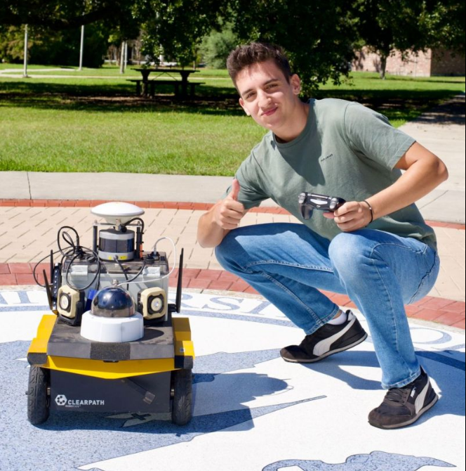

  

 

  

---

## 👋 Hey, I'm Enrique

<table>
<tr>
<td valign="middle">

I'm a Computer Science undergrad split between the **University of New Orleans** 🇺🇸 and **Universidad de Murcia** 🇪🇸, and a machine-learning researcher with a deep passion for **Deep Learning**. I love the whole journey — from sketching a model on a whiteboard to watching it actually run in the real world.

</td>
<td valign="middle" width="250" align="center">

</td>
</tr>
</table>

## 🧠 Deep Learning is my home base

I love exploring it across:

`Computer Vision` · `Neural Operators` · `NLP` · `Agentic Systems`

## 🔬 What I'm working on

<table>
<tr>
<td valign="middle" width="250" align="center">

</td>
<td valign="middle">

As an **undergraduate researcher** at the Gulf States Center for Environmental Informatics, I build PyTorch pipelines for automated defect detection in infrastructure — and get them running on a Jackal Clearpath robot via ROS. I'm especially into object detection (YOLO, Faster R-CNN, ResNet) and squeezing intelligent models down to run efficiently at the edge.

</td>
</tr>
</table>

## 🛠️ My toolbox

**Languages:** Python · Java · C · C++ · R · JavaScript · HTML · CSS

**ML / AI & Tools:** PyTorch · TensorFlow · scikit-learn · OpenCV · ROS · Git · Jupyter · VS Code · Linux · LaTeX

## 📫 Say hi

  

